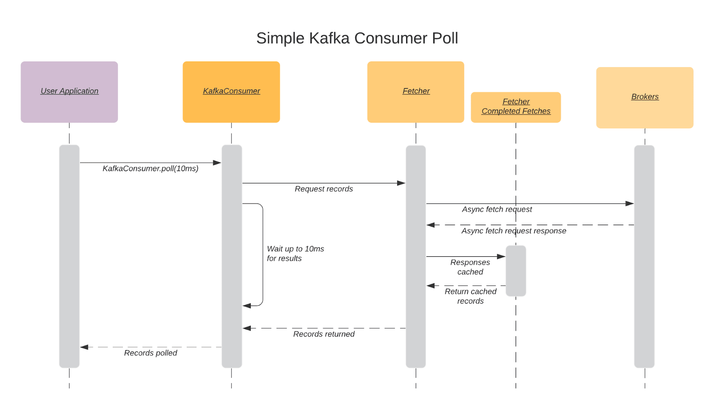

# Kafka knownledge
Kafka version: 3.1
## Kafka
Apache Kafka is a streaming platform that is free and open-source.
<details>
  <summary>Some features of Kafka</summary>
  <br/>
  
  + High-throughput: Kafka has a built-in patriation system known as a Topic
  + Fault-Tolerant: Kafka is resistant to node/machine failure within a cluster.
  + Durability: As Kafka supports messages replication, so,  messages are never lost. It is one of the reasons behind durability.
  + Scalability: Kafka can be scaled-out, without incurring any downtime on the fly by adding additional nodes.
  
</details>

## Zookeeper
ZooKeeper is a centralized service for maintaining configuration information, naming, providing distributed synchronization, and providing group services.

<details>
  <summary>Why is Zookeeper necessary for Apache Kafka?</summary>
  <br/>
  
  Zookeeper has four primary functions
  1. **Controller Election**
  2. **Cluster Membership:** Zookeeper also maintains a list of all the brokers (ex: ISRs, ...)
  3. **Topic Configuration:** ZooKeeper maintains the configuration of all topics, including the list of existing topics, number of partitions for each topic, location of the replicas, configuration overrides for topics, preferred leader node, among other details.
  4. **Access Control Lists:** Access control lists or ACLs for all the topics
  
  + Ref: https://www.cloudkarafka.com/blog/cloudkarafka-what-is-zookeeper.html
  + Ref: https://data-flair.training/blogs/zookeeper-in-kafka/
  
</details>


## Broker

### Controller

<details>
  <summary>What is controller?</summary>
  <br/>
  
  A controller is not too complex — it is a normal broker that simply has additional responsibility. It's responsible for managing the state of all partitions and replicas
  
  For example:
  + When the leader partition fails, the controller is responsible for selecting a new leader replica for the partition.
  + When the ISR set of a partition changes, the controller is responsible for notifying all brokers to update their metadata information
  + When increasing the number of partitions for a topic, the controller is responsible for the reallocation of partitions.

</details>

<details>
  <summary>Controller election</summary>
  <br/>

  When the controller goes down,
  1. Zookeeper informs all the brokers that the controller failed.
  2. All the brokers will apply to be the controller.
  3. The first broker who applies for this position will become the controller.
  
  + Ref: https://hackernoon.com/apache-kafkas-distributed-system-firefighter-the-controller-broker-1afca1eae302
  + Ref: https://developpaper.com/kafka-controller-election-principle/
  + Ref: https://cwiki.apache.org/confluence/display/KAFKA/KIP-631%3A+The+Quorum-based+Kafka+Controller
  
</details>

### Fault tolerance

Fault tolerance in Kafka is done by copying the partition data to other brokers which are known as **replicas**. Its also called a _replication factor_.

Each broker will hold one or more partitions. And each of these partitions can either be a **replica** or **leader** for the topic. All the writes and reads to a topic go through the **leader** and the **leader** coordinates to update replicas with new data.

<details>
  <summary>Leader, follower, ISRs</summary>
  <br/>

  **Leader partition:** A partition in the topic and is elected as leader. The leader partition responsible for reading/writing data
  **Follower partition:** A replica of leader on other brokers.
  **ISRs(in-sync replica):** the replicated partitions (followers) that are in sync with its leader.
  
</details>

<details>
  <summary>Leader partition election</summary>
  <br/>

  When the leader parition goes down:
  1. The Zookeeper informs the Controller.
  2. The controller selects one of the in-sync replicas (ISR) as the leader.
  3. When the broker comes back up, then it will be assigned again as the leader.
  
  + Ref: https://www.confluent.io/blog/hands-free-kafka-replication-a-lesson-in-operational-simplicity/#:~:text=KAFKA%20REPLICATION:%200%20TO%2060%20IN%201%20MINUTE&text=Every%20topic%20partition%20in%20Kafka,in%20the%20presence%20of%20failures.
  + Ref: https://medium.com/@anchan.ashwithabg95/fault-tolerance-in-apache-kafka-d1f0444260cf
</details>

## Producer
### Message Delivery Guarantees
<details>
  <summary>Types of delivery</summary>
  <br/>
  
  1. At-most once: Message loss is possible if the producer doesn’t retry on failures.
  2. At-least-once: There is no chance of message loss but the message can be duplicated if the producer retries when the message is already persisted.
  3. Exactly-once: Every message is guaranteed to be persisted in Kafka exactly once without any duplicates and data loss even where there is a broker failure or producer retry.
  
  Ref: https://ssudan16.medium.com/exactly-once-processing-in-kafka-explained-66ecc41a8548#:~:text=Exactly%2Donce%3A%20Every%20message%20is,broker%20failure%20or%20producer%20retry.
</details>
<details>
  <summary>Exactly-Once Processing</summary>
  <br/>
  
  There are two points to archive "_Exactly-Once_":
  1. Idempotent Guarantee
  2. Transactional Guarantee
  
  Ref: https://ssudan16.medium.com/exactly-once-processing-in-kafka-explained-66ecc41a8548#:~:text=Exactly%2Donce%3A%20Every%20message%20is,broker%20failure%20or%20producer%20retry.
  Ref: https://medium.com/@shesh.soft/kafka-idempotent-producer-and-consumer-25c52402ceb9
  Ref: https://blog.clairvoyantsoft.com/unleash-kafka-producers-architecture-and-internal-working-f33cba6c43aa
</details>
<details>
  <summary>Idempotent Guarantee</summary>
  <br/>
  
  With **idempotent guarantee**, this ensures _exactly-one_ only in a **single producer session**. _Exactly-one_ is not guaranteed when the producer is restarted.      
  When the producer is restarted, it will get a new `Pid` (or the same one, but with a new _epoch number_, when a `TransactionalId` is specified in the config).
  
</details>
<details>
  <summary>Transactional Guarantee</summary>
  <br/>

  
</details>

<details>
  <summary>Configuration</summary>
  <br/>

  
</details>

## Consumer

### How do consumers work?

<details>
  <summary>Poll and Internal Threads Behavior</summary>
  <br/>
  
  
  
  Ref: https://www.conduktor.io/kafka/kafka-consumer-important-settings-poll-and-internal-threads-behavior
</details>

<details>
  <summary>Some important consumers</summary>
  <br/>
  
  `fetch.min.bytes`
  
  `fetch.max.bytes`
  
  `fetch.max.wait.ms`
  
  `max.partition.fetch.bytes`
  
  `max.poll.records`
  
  `max.poll.interval.ms`
  
  `session.timeout.ms`
  
  `partition.assignment.strategy`
  
  + Ref: https://www.oreilly.com/library/view/kafka-the-definitive/9781491936153/ch04.html#:~:text=fetch.max.wait.ms,amount%20of%20data%20to%20return
  + Ref: https://cwiki.apache.org/confluence/display/KAFKA/KIP-74%3A+Add+Fetch+Response+Size+Limit+in+Bytes
</details>

<details>
  <summary>__consumer_offsets topic</summary>
  <br/>

  Since 0.9v Kafka stores topic offsets on the broker directly instead of relying on Zookeeper.
  
  Offsets in Kafka are stored as messages in a separate topic named `__consumer_offsets` . Each consumer commits a message into the topic at periodic intervals.
  
  The **Consumer Groups** are stored in the `__consumer_offsets` topic. That topic contains both the committed offsets and the groups metadata (group.id, members, generation, leader, ...). Groups are stored using `GroupMetadataMessage` messages (Offsets use `OffsetsMessage`).
  
  _Dump the group metadata:_
  
  ```
  ./bin/kafka-console-consumer.sh \
  --formatter "kafka.coordinator.group.GroupMetadataManager\$GroupMetadataMessageFormatter" \
  --bootstrap-server localhost:9092 \
  --topic __consumer_offsets
  ```
  
  + Ref: https://hackernoon.com/kafka-and-zookeeper-offsets-vvbe3xj7
  + Ref: https://stackoverflow.com/questions/59433201/where-are-consumer-groups-list-stored-in-recent-kafka-version#:~:text=Since%20Kafka%200.10%2C%20the%20list,leader%2C%20...).
    
</details>

### Consumer group

<details>
  <summary>Consumers & consumer groups</summary>
  <br/>
  
  
  
</details>

## Feature
### Transaction
<details>
  <summary>Why does Kafka producer produce 2 offsets per message in <strong>transaction</strong> mode?</summary>
  <br/>
  
  This is a design of Kafka. When producer publish a message or a batch of messages, it adds a extra message as a commit message to complete a transaction.
  
  For example: 
  + The producer publish 10 messages, and the current offset will be 11.
  + The producer publish 1 message, and current offset will be 2
  
  Ref: https://stackoverflow.com/questions/59152915/spring-kafka-transaction-causes-producer-per-message-offset-increased-by-two#:~:text=The%20offset%20is%20increased%20by,t%20commit%20the%20consuming%20offset.&text=However%20the%20count%20of%20messages,the%20msgs%20from%20topic2%20continuously.
</details>

### Data retention
<details>
  <summary>Types of Cleanup Policies</summary>
  <br/>
  
  + delete
  + compact
  + delete, compact
  
</details>
<details>
  <summary>Setting data retention</summary>
  <br/>
  
  To configure the cleanup policy, please follow the below steps:
  1. Choose cleanup policy
  
  `cleanup.policy`
  
  + **Default:**	delete
  + **Valid Values:**	[compact, delete]
  + **Server Default Property:** log.cleanup.policy
  
  Compact policy:
  
  + 
  
  Ref: https://medium.com/@sunny_81705/kafka-log-retention-and-cleanup-policies-c8d9cb7e09f8
</details>
<details>
  <summary>Kafka tombstone</summary>
  <br/>
  
  
  
  Ref: https://medium.com/@sunny_81705/kafka-log-retention-and-cleanup-policies-c8d9cb7e09f8
</details>
