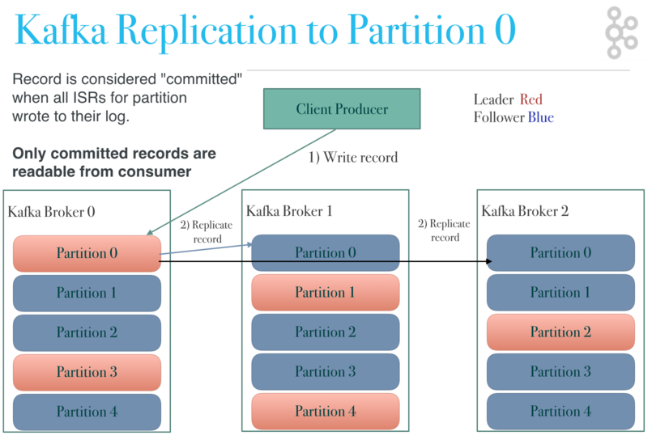
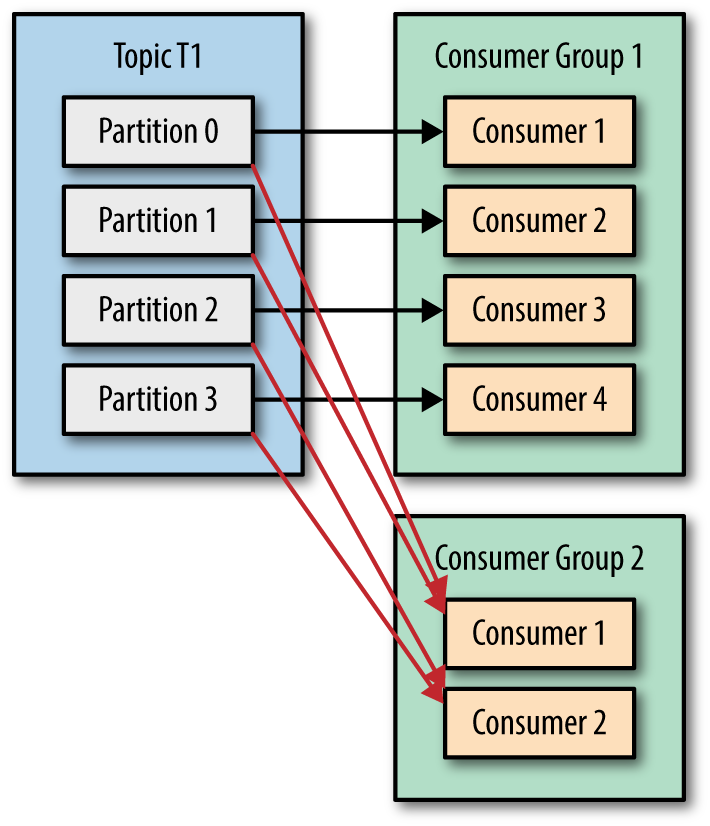

# Kafka knownledge
Kafka version: 3.1
## Kafka Fundamental
Apache Kafka is a streaming platform that is free and open-source.
<details>
  <summary>Some features of Kafka</summary>
  <br/>
  
  + **High-throughput:** Kafka has a built-in patriation system known as a Topic
  + **Fault-Tolerant:** Kafka is resistant to node/machine failure within a cluster.
  + **Durability:** As Kafka supports messages replication, so,  messages are never lost. It is one of the reasons behind durability.
  + **Scalability:** Kafka can be scaled-out, without incurring any downtime on the fly by adding additional nodes.
  
</details>

## Zookeeper

<details>
  <summary>What is Zookeeper?</summary>
  <br/>

  + ZooKeeper is a centralized service for maintaining configuration information, naming, providing distributed synchronization, and providing group services. 
  + Apache Kafka, responsible for partition management, message replication, fault tolerance, collaborating and ZooKeeper for cluster coordination and metadata management.
  
</details>

<details>
  <summary>Why is Zookeeper necessary for Apache Kafka?</summary>
  <br/>
  
  **Zookeeper several primary functions:**
  1. **Registration of Broker:** Kafka brokers register with ZooKeeper to enable other brokers and clients to find and contact them, and ZooKeeper keeps track of active brokers and their connection information.
  2. **Membership of Cluster:** ZooKeeper keeps track of the Kafka cluster's active brokers and stores membership information, allowing for dynamic cluster membership changes.
  3. **Controller Election:** ZooKeeper makes the controller election process easier by ensuring that only one broker is the controller.
  4. **Cluster Events and Alerts:** ZooKeeper sends alerts to Kafka brokers about cluster events and changes. For example, if a broker fails or quits the cluster, ZooKeeper can alert the other brokers.
  
</details>

<details>
  <summary>Kafka registration in Zookeeper</summary>
  <br/>

  + When a Kafka broker starts, it initiates a connection to ZooKeeper.
  + The broker registers itself by creating an entry in ZooKeeper under the `/brokers/ids` znode path. If a broker fails, its entry is removed from ZooKeeper.
  + The active Kafka controller monitors the `/brokers/ids` znode for changes, detects the new broker registration.
  + The controller sends an `UpdateMetadata` request to all other brokers in the cluster, informing them of the new broker’s presence.
  + Other brokers and clients can now discover and connect to the new broker using the information stored in ZooKeeper.
  
</details>

<details>
  <summary>Broker discovery</summary>
  <br/>
  
  + When a client starts, it connects to one or more bootstrap servers.
  + The client sends a metadata request to the bootstrap server. This request asks for information about the cluster, including the list of all brokers, topics, and partitions.
  + The bootstrap server responds with the cluster metadata. (list of all brokers, their addresses, and the partitions they manage.)
  + With this information, the client can then connect to the appropriate brokers directly for producing or consuming messages.
  
</details>

<details>
  <summary>Detecting a broker failure in Kafka</summary>
  <br/>

  + Brokers send regular heartbeats to ZooKeeper. If ZooKeeper does not receive a heartbeat within a specified time. It marks the broker as failed.
  + Upon detecting a broker failure, the Kafka controller initiates a leader election process. It selects new leaders from the in-sync replicas (ISR) and updates the metadata accordingly.
  + The controller updates the cluster metadata then propagated to all clients (producers and consumers).
  
</details>

## Broker

### Controller

<details>
  <summary>What is controller?</summary>
  <br/>
  
  A controller is not too complex — it is **a normal broker** that simply has additional responsibility. 
  
  + It's responsible for managing the  information about brokers, topics, partitions, and their leaders.
  + When brokers are added or removed from the cluster, the controller handles the reassignment of partitions to ensure balanced load distribution.
  
  _For example:_
  + When the leader partition fails, the controller is responsible for selecting a new leader replica for the partition.
  + When the ISR set of a partition changes, the controller is responsible for notifying all brokers to update their metadata information.
  + When increasing the number of partitions for a topic, the controller is responsible for the reallocation of partitions.

</details>

<details>
  <summary>Controller election</summary>
  <br/>

  Each partition in Kafka has one leader and multiple followers. The leader handles all read and write requests for that partition.

  When the controller goes down,
  1. Zookeeper informs all the brokers that the controller failed.
  2. All the brokers will apply to be the controller.
  3. The first broker who applies for this position will become the controller.
  
  + Ref: https://hackernoon.com/apache-kafkas-distributed-system-firefighter-the-controller-broker-1afca1eae302e/
  
</details>

### Fault tolerance

<details>
  <summary>About fault tolerance in Kafka</summary>
  <br/>

  Fault tolerance in Kafka is done by copying the partition data to other brokers which are known as **replicas**. Its also called a _replication factor_.

  Each broker will hold one or more partitions. And each of these partitions can either be a **replica** or **leader** for the topic. All the writes and reads to a topic go through the **leader** and the **leader** coordinates to update replicas with new data.

</details>
<details>
  <summary>Kafka Replicaton</summary>
  <br/>
  
  

  The broker that has the partition leader **handles all reads and writes** of records for the partition. Kafka replicates the record in the leader partition to followers. the record is considered **“committed”** when all in-sync replica partition wrote to their log. 

  **How it works?**

  + The producer sends the message to the leader of the partition. Each partition has one leader and multiple followers.
  + The leader writes the message to its local log.
  + Followers pull the message from the leader and write it to their logs.
  + Once the followers have successfully written the message to their logs, they send an acknowledgment back to the leader.
  + The leader waits for acknowledgments from all in-sync replicas.
  + The leader then sends an acknowledgment back to the producer, confirming the message has been successfully replicated and committed.
  
</details>

<details>
  <summary>Leader, follower, ISRs</summary>
  <br/>

  + **Replication Factor:** Each topic has a configurable replication factor, which determines the number of copies of each partition. For example, a **_replication factor_** of **_3_** means there are **_three_** copies of each partition.
  + **Leader partition:** A partition in the topic and is elected as leader. The leader partition responsible for reading/writing data.
  + **Follower partition:** A follower partition is a replica of a partition that is not the leader.
  + **ISRs(in-sync replica):** ISRs are replicas of a partition (followers) that are fully synchronized with the leader replica. ISRs include the leader and followers.
  
</details>

<details>
  <summary>Leader partition election</summary>
  <br/>

  When the leader parition goes down:
  + The Zookeeper informs the Controller.
  + The controller selects one of the in-sync replicas (ISR) as the leader.
  + The controller sends a LeaderAndIsrRequest to the new leader and updates the metadata.
  
  + Ref: https://www.confluent.io/blog/hands-free-kafka-replication-a-lesson-in-operational-simplicity/#:~:text=KAFKA%20REPLICATION:%200%20TO%2060%20IN%201%20MINUTE&text=Every%20topic%20partition%20in%20Kafka,in%20the%20presence%20of%20failures.
  + Ref: https://medium.com/@anchan.ashwithabg95/fault-tolerance-in-apache-kafka-d1f0444260cf
</details>
<details>
  <summary>Broker recovery</summary>
  <br/>

  + Kafka ensures that committed messages are replicated to all in-sync replicas.
  + If a follower falls behind or fails, it is removed from the ISR until it catches up again.
  + When a failed broker recovers, it starts catching up by pulling data from the current leader until it is fully synchronized.
  + Once a recovering broker has caught up with the leader’s log, it rejoins the ISR.
  + Kafka guarantees that a committed message will not be lost as long as there is at least one in-sync replica alive.
</details>
<details>
  <summary>Broker rebalancing</summary>
  <br/>

  **Rebalancing can be triggered by several events:**

  + When a new consumer **joins a consumer group**, partitions need to be reassigned to include the new consumer.
  + When a consumer leaves the group (e.g., due to failure or shutdown), its partitions need to be reassigned to the remaining consumers.
  + Adding or removing partitions from a topic can also trigger a rebalance to ensure all partitions are assigned.

  **How Rebalancing Works**

  
  
</details>

### Quorum

<details>
  <summary>Formula</summary>
  <br/>

  Quorum can be defined with a formula.
  ```
  q = 2n+1
  ```
  
  `q` is the total number of nodes, and `n` is the number of allowed failure nodes.

  _For example:_ if `n` = **2**, quorum size is **5**.
  
  + Ref: https://stackoverflow.com/questions/58761164/in-kafka-ha-why-minimum-number-of-brokers-required-are-3-and-not-2#:~:text=While%20doing%20R%26D%2C%20we%20found,zookeeper%20%26%20kafka%20brokers%20are%203.
</details>

### Topic & Partition

<details>
  <summary>What is a partition in Kafka?</summary>
  <br/>

  + It's a unit of data that can be stored and replicated independently. Each message produced to a topic is assigned to a specific partition within that topic.
  + One topic can have one or more partition, and each partition is only consumed by one consumer in the same consumer group.
  
</details>
<details>
  <summary>Replication factor</summary>
  <br/>

  The replication factor refers to **the number of copies of a topic’s partitions** that are maintained across different brokers in the cluster.

  
  
</details>

## Producer
### Message Delivery Guarantees
<details>
  <summary>Message Delivery Semantics</summary>
  <br/>

  
  
  1. At-most once: Message loss is possible if the producer doesn’t retry on failures.
  2. At-least-once: There is no chance of message loss but the message can be duplicated if the producer retries when the message is already persisted.
  3. Exactly-once: Every message is guaranteed to be persisted in Kafka exactly once without any duplicates and data loss even where there is a broker failure or producer retry.
  
  Ref: https://ssudan16.medium.com/exactly-once-processing-in-kafka-explained-66ecc41a8548#:~:text=Exactly%2Donce%3A%20Every%20message%20is,broker%20failure%20or%20producer%20retry.
</details>
<details>
  <summary>Exactly-Once Processing</summary>
  <br/>
  
  There are two points to archive "_Exactly-Once_":
  1. Idempotent Guarantee
  2. Transactional Guarantee

  **Terminologies**

  1. _Producer ID (PID)_
  
  A Unique Identifier assigned to the producer by the broker.

  If `transactional.id` is not specified, a fresh PID is generated every-time on producer initialization. If `transactional.id` is specified,the broker stores mapping of Transactional ID to PID so that it can return the same PID on producer restart.
  
  2. _Epoch Number_
  
  The epoch number is an integer that is used alongside PID to uniquely identify the latest active producer which is only relevant if `transactional.id` is set.
  
  3. _Sequence Number_
  
  The producer maintains Sequence Number for every message per PID and Topic Partition combination. The boroker will reject if it receives a message whoes **Sequence Number** is not exactly one greater than what was stored in the broker.
  
  4. _Control Message_
  
  The two types of Control Messages are `COMMIT` and `ABORT`.
  
  5. _Transaction Coordinator_
  
  Transaction Coordinator maintains a map of `transactional.id` holds the metadata includes: PID, Epoch Number, transaction timeout, last updated time of the transaction, transaction status, list of Topic Partitions
  
  6. _Transaction Log_
  
  __transaction_state topic
  
  + Ref: https://ssudan16.medium.com/exactly-once-processing-in-kafka-explained-66ecc41a8548#:~:text=Exactly%2Donce%3A%20Every%20message%20is,broker%20failure%20or%20producer%20retry.
  
  + Ref: https://www.javacodegeeks.com/2020/05/kafka-exactly-once-semantics.html
  + Ref: https://ssudan16.medium.com/exactly-once-processing-in-kafka-explained-66ecc41a8548#:~:text=Exactly%2Donce%3A%20Every%20message%20is,broker%20failure%20or%20producer%20retry.
  + Ref: https://blog.clairvoyantsoft.com/unleash-kafka-producers-architecture-and-internal-working-f33cba6c43aa
  + Ref: https://cwiki.apache.org/confluence/display/KAFKA/KIP-98+-+Exactly+Once+Delivery+and+Transactional+Messaging
</details>
<details>
  <summary>Idempotent Guarantee</summary>
  <br/>

  This means that even if the producer attempts to send the same message repeatedly, only one copy of the message will be actually sent to the Kafka cluster.
  
  With **idempotent guarantee**, this ensures _exactly-one_ only in a **single producer session**. _Exactly-one_ is not guaranteed when the producer is restarted.      
  When the producer is restarted, it will get a new `PID` (producer ID).
  
  
  
  ```
  producerProps.put("enable.idempotence", "true");
  producerProps.put("transactional.id", "100");
  ```
  
  + Ref: https://medium.com/@shesh.soft/kafka-idempotent-producer-and-consumer-25c52402ceb9
</details>
<details>
  <summary>Transactional Guarantee</summary>
  <br/>

  + By combining transactions with idempotence and acks, Kafka ensures exactly-once delivery semantics.
  + A transaction is committed after the producer receives the necessary acknowledgments (acks) for all the messages included in the transaction.
  + Once all messages have been acknowledged, the producer can commit the transaction using `commitTransaction()`.
  
  ```
  Properties props = new Properties();
  props.put("bootstrap.servers", "localhost:9092");
  props.put("acks", "all");
  props.put("enable.idempotence", "true");
  props.put("transactional.id", "my-transactional-id");
  KafkaProducer<String, String> producer = new KafkaProducer<>(props);
  ```
  
  + Ref: https://stackoverflow.com/questions/57321763/kafka-producer-idempotence-exactly-once-or-just-producer-transaction-is-enough
  + Ref: https://stackoverflow.com/questions/56156749/how-does-kafka-know-whether-to-roll-forward-or-roll-back-a-transaction
</details>

<details>
  <summary>Guaranteed Message Ordering</summary>
  <br/>

  The `max.in.flight.requests.per.connection` setting can be used to increase throughput by allowing the client to send multiple unacknowledged requests before blocking. However it can be is a risk of message re-ordering occurring when retrying due to errors.
  
  
  
</details>

### Partitioning strategies

<details>
  <summary>Types of Strategies</summary>
  <br/>
   
  
  + Ref: https://www.codetd.com/en/article/13051951
  + Ref: https://www.confluent.io/blog/apache-kafka-producer-improvements-sticky-partitioner/
</details>

## Consumer

### Fundamental concepts

<details>
  <summary>Pull vs push</summary>
  <br/>
   
</details>

### Partition assignment strategies

<details>
  <summary>Types of Strategies</summary>
  <br/>
  
  
  + Ref: https://medium.com/streamthoughts/understanding-kafka-partition-assignment-strategies-and-how-to-write-your-own-custom-assignor-ebeda1fc06f3#:~:text=Kafka%20Clients%20provides%20three%20built,%3A%20Range%2C%20RoundRobin%20and%20StickyAssignor.
</details>

### How do consumers work?

<details>
  <summary>Poll and Internal Threads Behavior</summary>
  <br/>
  
  
  
  Ref: https://www.conduktor.io/kafka/kafka-consumer-important-settings-poll-and-internal-threads-behavior
</details>

<details>
  <summary>Some important consumers</summary>
  <br/>
  
  `fetch.min.bytes`
  
  `fetch.max.bytes`
  
  `fetch.max.wait.ms`
  
  `max.partition.fetch.bytes`
  
  `max.poll.records`
  
  `max.poll.interval.ms`
  
  `session.timeout.ms`
  
  `partition.assignment.strategy`
  
  + Ref: https://www.oreilly.com/library/view/kafka-the-definitive/9781491936153/ch04.html#:~:text=fetch.max.wait.ms,amount%20of%20data%20to%20return
  + Ref: https://cwiki.apache.org/confluence/display/KAFKA/KIP-74%3A+Add+Fetch+Response+Size+Limit+in+Bytes
</details>

<details>
  <summary>__consumer_offsets topic</summary>
  <br/>
  
  Offsets in Kafka are stored as messages in a separate topic named `__consumer_offsets` . Each consumer commits offset into the topic `__consumer_offsets`, ensuring that consumers can resume processing from the correct position in case of failure.
  
  The **Consumer Groups** are stored in the `__consumer_offsets` topic. That topic contains both the committed offsets and the groups metadata (group.id, members, generation, leader, ...). Groups are stored using `GroupMetadataMessage` messages (Offsets use `OffsetsMessage`).
  
  _Dump the group metadata:_
  
  ```
  ./bin/kafka-console-consumer.sh \
  --formatter "kafka.coordinator.group.GroupMetadataManager\$GroupMetadataMessageFormatter" \
  --bootstrap-server localhost:9092 \
  --topic __consumer_offsets
  ```

  Example record in `__consumer_offsets`:

  ```
  {
    "group_id": "my-consumer-group",
    "topic": "my-topic",
    "partition": 0,
    "offset": 12345,
    "metadata": "",
    "commit_timestamp": 1633024800000,
    "leader_epoch": 42
  }
  ```

  + **group_id:** The ID of the consumer group (`my-consumer-group`).
  + **topic:** The name of the topic being consumed (`my-topic`).
  + **partition:** The partition number within the topic (0).
  + **offset:** The position of the next message to be read (12345).
  + **metadata:** Any additional metadata (empty in this case).
  + **commit_timestamp:** The timestamp when the offset was committed (in milliseconds since epoch).
  + **leader_epoch:** The epoch of the leader broker for the partition at the time of the commit.

  _Note:_ Since 0.9v Kafka stores topic offsets on the broker directly instead of relying on Zookeeper.
  
  + Ref: https://hackernoon.com/kafka-and-zookeeper-offsets-vvbe3xj7
  + Ref: https://stackoverflow.com/questions/59433201/where-are-consumer-groups-list-stored-in-recent-kafka-version#:~:text=Since%20Kafka%200.10%2C%20the%20list,leader%2C%20...).
    
</details>

### Consumer group

<details>
  <summary>Consumers & consumer groups</summary>
  <br/>

  

  A Kafka consumer group is a collection of consumers that work together to consume data from Kafka topics.  

  There are several scenarios need to consider when using consumer group:
  
  **Scenario 1:** If we have a topic with _4 partitions_ and _1 consumer group_ consisting of only _1 consumer_. The consumer has subscribed to the topic and is assigned all the partitions to a consumer.

  **Scenario 2:** If we have a topic with _4 partitions_ and _1 consumer group_ consisting of _2 consumers_. Consumer1 assigned to read from partitions 0, 2 and and Consumer2 assigned to read from partitions 1, 3.

  **Scenario 3:** If we have a topic with _4 partitions_ and _1 consumer group_ consisting of _5 consumers_. Then every consumer would be assigned a single partition and the remaining consumer (Consumer5) would be left idle.

  **Scenario 4:** If we want to assign multiple consumers to read from the same partition, then you can add these consumers to different consumer groups, and have both of these consumer groups subscribed to the topic.
  
</details>

<details>
  <summary>Group Coordination</summary>
  <br/>

  Kafka uses a group coordinator to manage the consumers in a group. The coordinator assigns partitions to consumers and handles rebalancing when consumers join or leave the group.
  
</details>

## Other Features
### Transaction
<details>
  <summary>Why does Kafka producer produce 2 offsets per message in <strong>transaction</strong> mode?</summary>
  <br/>
  
  This is a design of Kafka. When producer publish a message or a batch of messages, it adds a extra message as a commit message to complete a transaction.
  
  For example: 
  + The producer publish 10 messages, and the current offset will be 11.
  + The producer publish 1 message, and current offset will be 2
  
  Ref: https://stackoverflow.com/questions/59152915/spring-kafka-transaction-causes-producer-per-message-offset-increased-by-two#:~:text=The%20offset%20is%20increased%20by,t%20commit%20the%20consuming%20offset.&text=However%20the%20count%20of%20messages,the%20msgs%20from%20topic2%20continuously.
</details>

### Data retention
<details>
  <summary>Types of Cleanup Policies</summary>
  <br/>
  
  + delete
  + compact
  + delete, compact
  
</details>
<details>
  <summary>Setting data retention</summary>
  <br/>
  
  To configure the cleanup policy, please follow the below steps:
  1. Choose cleanup policy
  
  `cleanup.policy`
  
  + **Default:**	delete
  + **Valid Values:**	[compact, delete]
  + **Server Default Property:** log.cleanup.policy
  
  Compact policy:
  
  + 
  
  Ref: https://medium.com/@sunny_81705/kafka-log-retention-and-cleanup-policies-c8d9cb7e09f8
</details>
<details>
  <summary>Kafka tombstone</summary>
  <br/>
  
  
  
  Ref: https://medium.com/@sunny_81705/kafka-log-retention-and-cleanup-policies-c8d9cb7e09f8
</details>

### Dead letter queue

### Log

### KRaft
